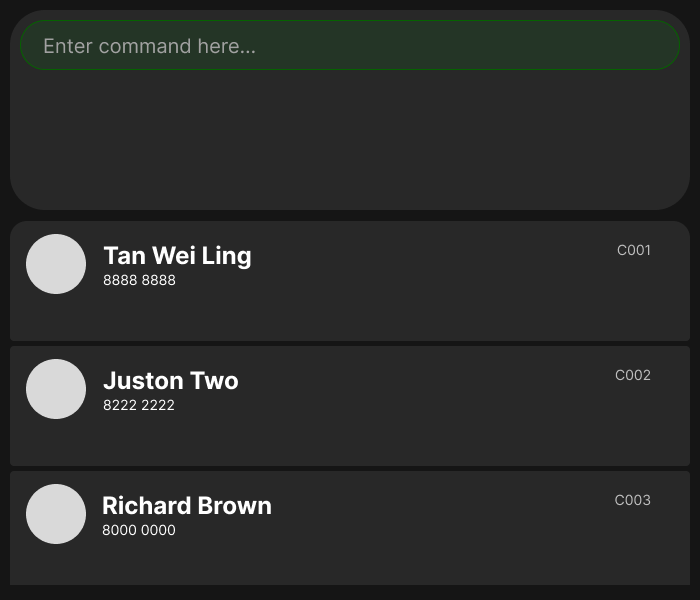

# Cindy

Cindy is a desktop application designed for freelance gym trainers who manage a small roster of fitness clients.

Cindy helps trainers:

* Manage their clients' contact details.
* Organize training schedules.
* Record and track their clients' fitness progress.

Cindy combines the speed of a Command Line Interface (CLI) with the convenience of a Graphical User Interface (GUI), allowing trainers to perform frequent tasks efficiently while retaining a clear visual overview of their clients.

For detailed documentation, refer to https://ay2627s1-cs2103t-t15-1.github.io/tp/docs/.

* This project is a **part of the se-education.org** initiative. If you would like to contribute code to this project, see [se-education.org](https://se-education.org/#contributing-to-se-edu) for more info.
