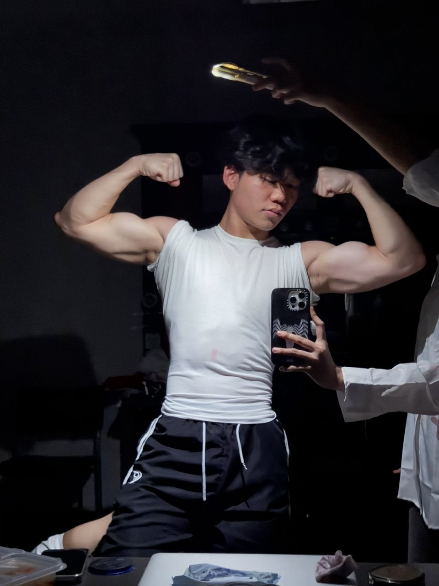
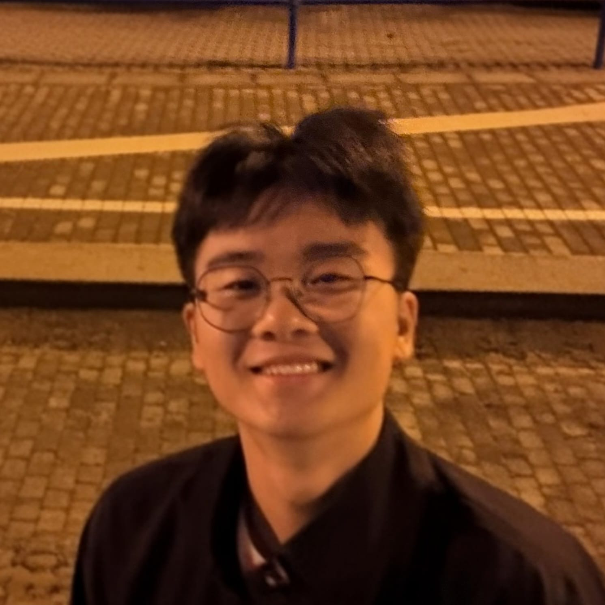
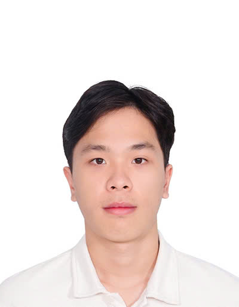

# About Us

We are a team based in the [School of Computing, National University of Singapore](http://www.comp.nus.edu.sg).

You can reach us at the email `seer[at]comp.nus.edu.sg`

## Project team

### Wong Zhong Xian

[[github](https://github.com/wongzhongxian)]

* Role: Developer
* Responsibilities: In charge of documentation: Responsible for the quality of various project documents.

### Chen Ling Song

[[github](https://github.com/lingsongc)]

* Role: Developer
* Responsibilities: Scheduling and tracking

### Nguyen Hoang Thai

[[github](https://github.com/ThaiNguyen0806)]

* Role: Developer
* Responsibilities: Testing

### Jean Doe

[[github](http://github.com/johndoe)]
[[portfolio](team/johndoe.md)]

* Role: Developer
* Responsibilities: Dev Ops + Threading

### James Doe

[[github](http://github.com/johndoe)]
[[portfolio](team/johndoe.md)]

* Role: Developer
* Responsibilities: UI
